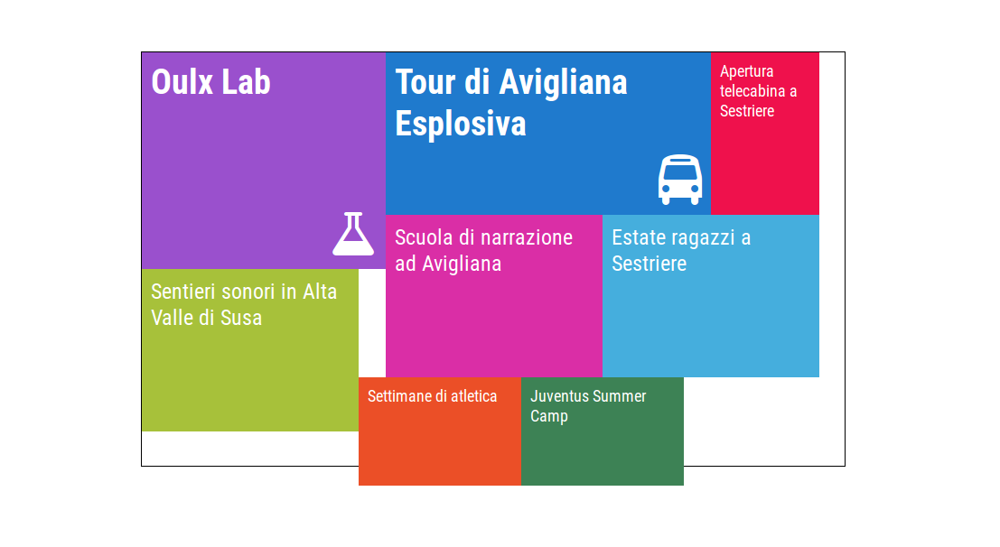

# Weighted Tiles

Javascript library to draw tiles inside a w\*h area, optimizing space and tiles' weight

[Demo1](http://codepen.io/abidibo/pen/yOYVPr)
[Demo2](http://codepen.io/abidibo/pen/BKjXvK)

## Usage (I need this stuff yesterday!)

Given a container:

    

and a series of items to display with different weights (different content relevance)

    var items = [
        { weight: 9, id: 1, title: 'Tour di Avigliana Esplosiva', icon: 'fa-bus' },
        { weight: 6, id: 2, title: 'Sentieri sonori in Alta Valle di Susa' },
        { weight: 6, id: 3, title: 'Estate ragazzi a Sestriere' },
        { weight: 6, id: 4, title: 'Scuola di narrazione ad Avigliana' },
        { weight: 3, id: 5, title: 'Juventus Summer Camp' },
        { weight: 3, id: 6, title: 'Settimane di atletica' },
        { weight: 3, id: 7, title: 'Apertura telecabina a Sestriere' },
        { weight: 9, id: 8, title: 'Oulx Lab', icon: 'fa-flask' },
    ];

create a callback function to render the content of the calculated elements (which are positioned absolute inside the container),
and instantiate WeightedTiles:

    var callback = function(obj) {
        obj.elements.forEach(function(el) {
            var html = "
" + el.item.title + '
';
            if(el.item.icon) {
                html += '<i class="fa ' + el.item.icon + '"></i>';
            }
            el.html(html).appendTo($('#canvas'));
        });
    }

    var weighted_tiles = new WeightedTiles(items, 780, 460, { 
        callback: callback
    });

use css to improve graphics

    #canvas {
        margin: auto;
        position: relative;
        width: 780px;
        height: 460px;
        border: 1px solid #000;
    }
    .tile {
        color: #fff;
        padding: 10px;
        font-family: 'Roboto Condensed', sans-serif;
    }
    .tile .fa {
        position: absolute; bottom: 10px;right: 10px;
        font-size: 3.5rem;
    }
    .tile:hover {
        transform: scale(1.2);
        z-index: 100;
    }
    .id1 {
        background: #1f7acd;
    }
    .id2 {
        background: #a7c13a;
    }
    .id3 {
        background: #45aedd;
    }
    .id4 {
        background: #da2ea6;
    }
    .id5 {
        background: #3d8255;
    }
    .id6 {
        background: #eb4f27;
    }
    .id7 {
        background: #ef114c;
    }
    .id8 {
        background: #9a50cd;
    }
    .w9 {
        font-size: 38px;
        font-weight: 700;
    }
    .w6 {
        font-size: 24px;
        font-weight: 400;
    }
    .w3 {
        font-size: 18px;
        font-weight: 400;
    }

## Usage (I want to understand how it works)

The library tries to calculate the best tiles configuration respecting some rules:
- more weight means greater area (in a proportional way, linear proportion between weight and tile's area exactly)
- more weight means higher probability to have the tile placed near the top
- a tolerance of 20% is accepted in the y direction, in other words tiles can overflow the height of the canvas of 20%.
- the tile's h/w ratio cannot overcome a given value (given through options)
- obviously tiles cannot overlap, unless the maximum number of attemps is reached, in such case try increasing it (through options)

Different set of criteria are used for different configurations. Used criteria (and so the number of tried configurations) can be controlled through options, trying more 
configurations assures a better result (minor empty spaces), while less configurations assures best performance.

### Instantiating WeightedTiles

    var weightd_tiles = new WeightedTiles(items, w, h, options)

- __items__: the items to be rendered, must be an array of objects. Each object must have a weight and a id property.
- __w__: the width of the container
- __h__: the height of the container
- __options__: an object of options:
    - __max\_ratio__:  the maximum ratio H/W allowed for a tile (could be quite difficult to insert text inside H/W>>1 shapes). Default `2`.
    - __log\_verbosity__: developing this stuff wasn't a joke, so the library outputs many logs. Choose the verbosity (0 -> 5), use 0 for production (logs cost performance). __Do not set a verbosity of 5 with more than 1 active configuration (criteria), I advised you__. Default: `0`.
    - __get_all_configurations__: many configurations are tried (if you want), then with this option you decide if the provided callback which renders the elements should receive all the tried configurations or only the one which optimizes the empty space left in the container area. Default: `false`.
    - __criteria__: criteria used to try different configurations (explained below). Default:

            {
                0: ['Up', 'Down'],
                1: ['Down', 'Up'],
                2: ['UpPosition', 'DownPosition'],
                3: ['DownPosition', 'UpPosition'],
                4: ['Up', 'DownPosition'],
                5: ['Down', 'UpPosition']
            }
    - __max_attempts__: there is maximum number of loops allowed when trying to place a tile, I don't like very much infinite loops. Set an higher value only if your tiles overlap. Default: `10000`
    - __item_el_title_class__: in the end a tile will be a jQuery object, every item will receive this css class. Default: `'tile'`. Notice that every item will receive also a `'id' + item.id` css class.
    - __item_el_weight_class__: every item will receive a css class formed by this value plus the item weight (i.e. w9). Default `'w'`
    - __callback__: a function called when the algoritm ends. It receives the WeightedTiles instance context and an argument explained below. Default: `function(obj) { console.log(obj); }`

### The callback function

Let's see the argument it receives. If the option `get_all_configurations` is set to true, then it receives an array of configuration objects, otherwise it receives only the optimized configuration object.

The configuration object has the following properties:

- __criteria__: the criteria used for this configuration, i.e `['Up', 'Down']`
- __id__: the configuration id (the key of the criteria)
- __empty__: the number of empty grid units which the configuration leaves in the container area (the minor it is, the better the result should be)
- __elements__: array of jQuery elements representing the tiles. Each element has some extra properties:
    - __item__: the original item object it represents
    - __x0__: the x coordinate of the left side of the tile in the grid unit system (explained below)
    - __x1__: the x coordinate of the right side of the tile in the grid unit system
    - __y0__: the y coordinate of the top side of the tile in the grid unit system
    - __y1__: the y coordinate of the bottom side of the tile in the grid unit system

    By default every element will have a text equals to the string `weight + ' - ' + item.id`, just replace it.

### The grid system

This algoritm doesn't work in pixels. Instead the total available area is divided by the total weight sum, in order to calculate a unit weight area. Then an invisible grid made of such units is created.
If the grid is not entirely contained inside the given area, each side of the unit is halved, and so on, untill a grid system fits completely inside the total area. When it happens the system uses it as a grid system.
Obviously all calculations (how many units are needed for a tile of weight W) will take into account the halving number.

### Criteria

I've implemented 4 different criteria.

#### Up

We have the tile area which respect its weight, we need to find a shape and a position. The area is given in number of grid units, to find a shape the factors of this number are evaluated.
In this criteria attempt, the middle factor is taken as shape width, then it tries to collocate the tile with this shape. If it can't the following shape is considered, using the next factor as width, and so on.
So in this criteria attempt, shapes with increasing width are tried.
If it doesn't succeed, after the paired criteria attempt, the initial position is changed and all the shapes are tried again.

#### UpPosition

As above, but this time, for every shape, all the available starting positions are tried. So a shape is tested in all position before passing to the next one.

#### Down

In this criteria attempt, the middle factor minus one is taken as shape width, then it tries to collocate the tile with this shape. If it can't the following shape is considered, using the previous factor as width, and so on.
So in this criteria attempt, shapes with decreasing width are tried (not all shapes are allowed due to the __max_ratio__ option).
If it doesn't succeed, after the paired criteria attempt, the initial position is changed and all the shapes are tried again.

#### DownPosition

As above, but this time, for every shape, all the available starting positions are tried. So a shape is tested in all position before passing to the next one.

## TODO

- improve the performance (I still don't know how exactly, but surely the collision function or the 'get the starting position' functions can be improved)
- support different relations weight <-> graphics, i.e. more weight means highest probability to have the tiles placed in the center
- have a beer
